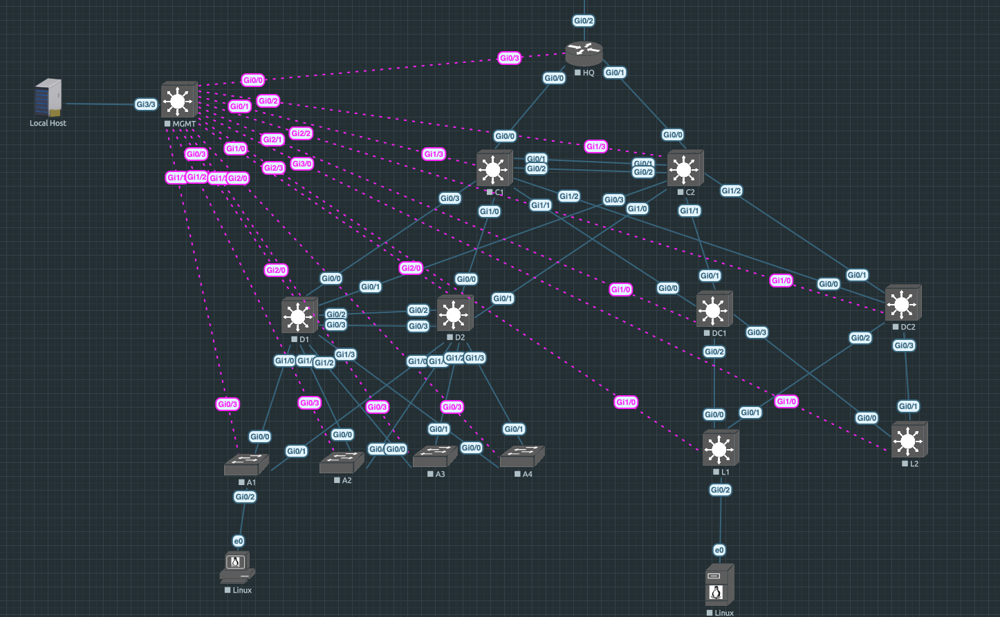

# Network Automation
Using Nornir, Netmiko, and Jinja2 Template files to send configurations

TOPOLOGY:

------------------------------------------------------------------------------------------

This is my attepmt at sending the configuration of a three tier campus network as specified in the host definition files.
